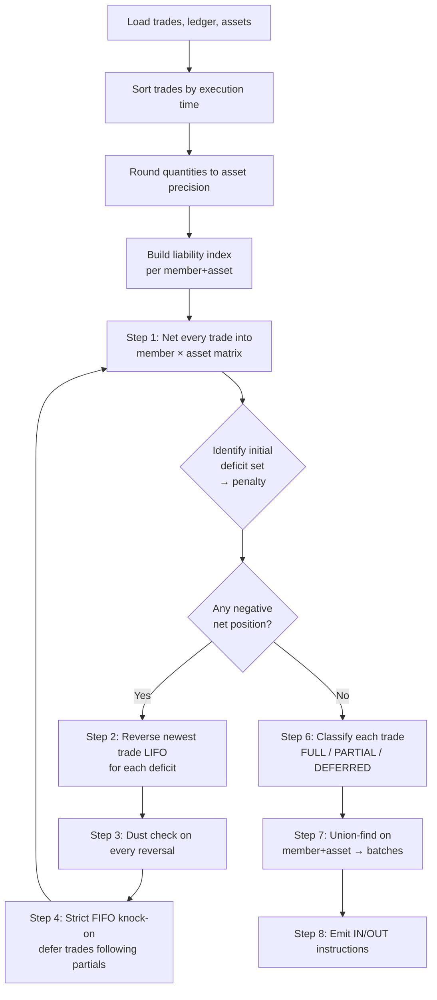
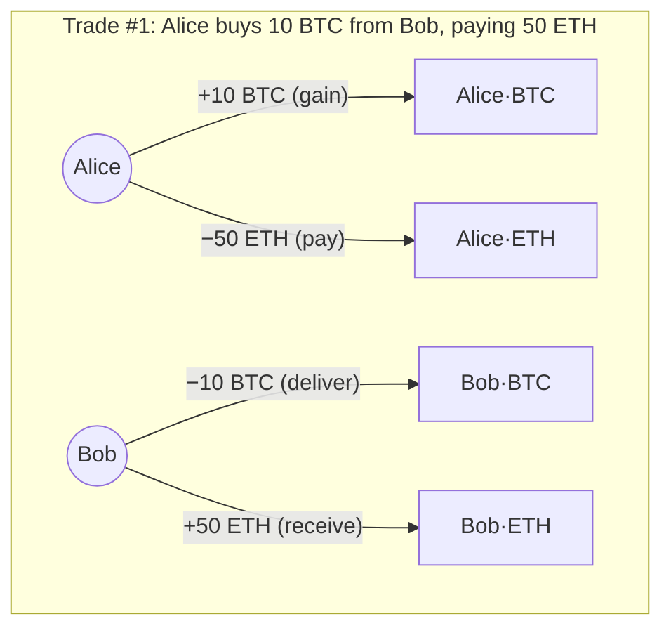
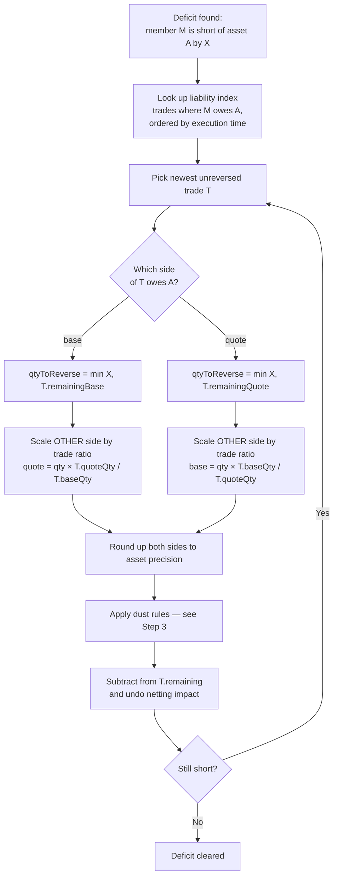
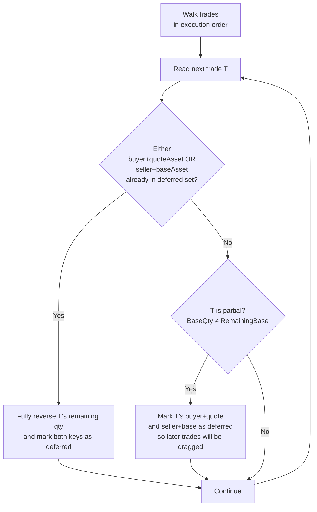
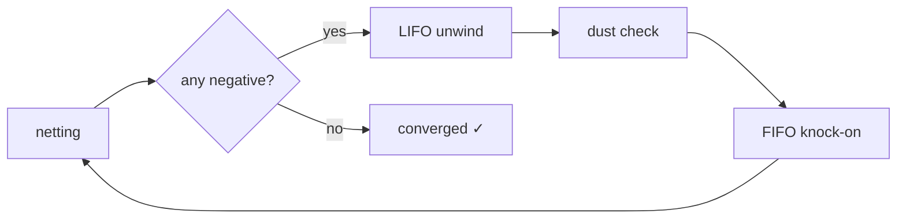
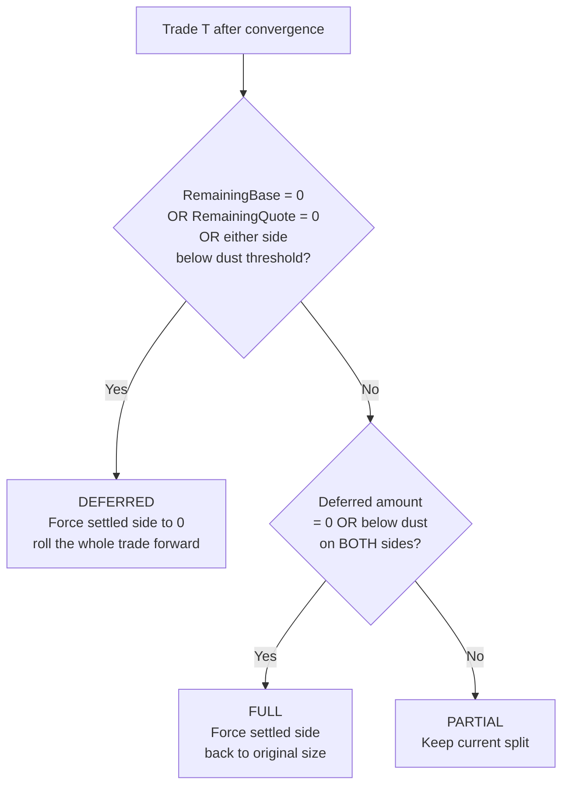
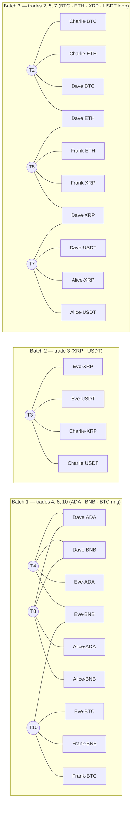
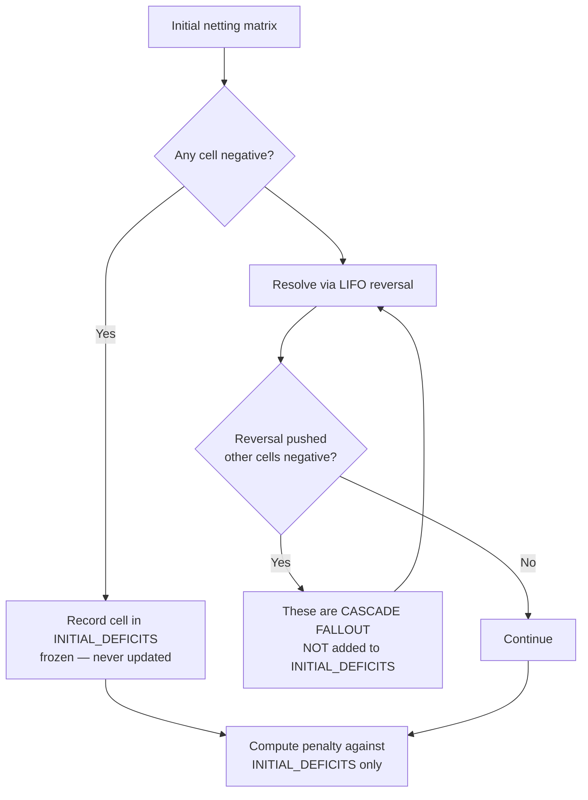
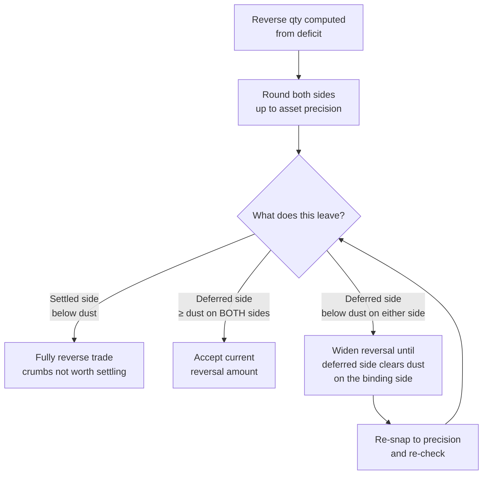

# Settlement Engine — Complete Reference

The `settlement` package implements a multilateral trade settlement engine.
Given a set of executed trades, opening ledger balances, and per-asset
reference data, it produces the minimum set of ledger movements needed to
honour those trades — classifying each trade as fully settled, partially
settled, or deferred, and grouping the movements into independent batches
that can be applied atomically and in parallel.

This document is the long-form reference for that engine. It first
explains the inputs, outputs, and core rules, and then walks the algorithm
end-to-end on a worked example.

---

## Table of Contents

1. [What the engine does](#1-what-the-engine-does)
2. [Inputs and outputs](#2-inputs-and-outputs)
3. [Core rules](#3-core-rules)
4. [The example dataset](#4-the-example-dataset)
5. [Trade blotter and trade flow](#5-trade-blotter-and-trade-flow)
6. [Anatomy of a trade](#6-anatomy-of-a-trade)
7. [Step 1 · Net everything](#7-step-1--net-everything)
8. [Step 2 · Resolve deficits (LIFO unwinding)](#8-step-2--resolve-deficits-lifo-unwinding)
9. [Step 3 · Dust threshold rules](#9-step-3--dust-threshold-rules)
10. [Step 4 · Strict FIFO ordering](#10-step-4--strict-fifo-ordering)
11. [Step 5 · Cascade and convergence](#11-step-5--cascade-and-convergence)
12. [Step 6 · Classify each trade](#12-step-6--classify-each-trade)
13. [Step 7 · Split into independent batches](#13-step-7--split-into-independent-batches)
14. [Step 8 · Emit settlement instructions](#14-step-8--emit-settlement-instructions)
15. [Penalty logic](#15-penalty-logic)
16. [Numeric precision](#16-numeric-precision)
17. [Why this design](#17-why-this-design)
18. [Glossary](#18-glossary)

---

## 1. What the Engine Does

At the end of every settlement window the engine takes a set of executed
trades and decides — given the members' opening balances and per-asset
constraints — what the minimum set of ledger movements is that honours
those trades. Where members have committed to deliver more than they own
(and won't be receiving the difference within the window), the engine
unwinds enough of their latest trades to make the books balance,
classifies every trade as `FULL`, `PARTIAL`, or `DEFERRED`, groups the
remaining movements into independent batches that can be settled in
parallel, and reports a penalty for each shortfall that was a true
commitment rather than engine-induced fallout.

The engine is multilateral: every trade depends on every other through
the shared ledger. A member may be short on one trade but receive that
same asset on another, so the algorithm netts all trade flows first and
then only acts on the true shortfalls. The convergence loop is the heart
of the engine — reversing one trade can make another cell negative, and
the engine alternates resolution and FIFO knock-on until no cell on the
netting matrix is negative.

---

## 2. Inputs and Outputs

The package entry point is:

```go
func GenerateInstructions(
    trades []Trade,
    ledger []LedgerEntry,
    assets []Asset,
    strictFifo bool,
) Results
```

### 2.1 Inputs

The engine consumes three read-only interfaces, so the caller can supply
any concrete type.

#### `Trade`

```go
type Trade interface {
    TradeID() string
    ExecTime() int64        // nanoseconds since Unix epoch
    Buyer() string
    Seller() string
    BaseAsset() string
    QuoteAsset() string
    Quantity() decimal.Decimal   // base quantity
    Price() decimal.Decimal      // quote per unit base
}
```

Each trade has two sides — a buyer and a seller — and a trading pair
(e.g. `BTC-ETH`, where BTC is base and ETH is quote). The buyer pays the
notional (`Quantity × Price` in quote currency) and receives the
quantity in the base currency; the seller does the opposite.

`ExecTime` drives ordering: LIFO unwinding picks the **newest** trade
first, and strict FIFO settlement honours the **earliest** commitments
first. When two trades share an `ExecTime`, original input order breaks
the tie.

#### `LedgerEntry`

```go
type LedgerEntry interface {
    Member() string
    Asset()  string
    Balance() decimal.Decimal
}
```

The opening balance for one `(member, asset)` cell. Members without an
entry for a given asset are treated as holding zero of it.

#### `Asset`

```go
type Asset interface {
    Symbol() string
    DustThreshold() decimal.Decimal
    Precision() int
}
```

- **Precision** is the maximum number of decimals an amount of this
  asset can carry. Inputs are rounded *down* to this precision;
  reversals are rounded *up* (so a reversal never under-undoes).
- **DustThreshold** is the smallest amount worth moving. Anything in
  `(0, DustThreshold)` is sub-dust and must not appear on a settlement
  leg.

#### The `strictFifo` flag

When `true`, an unsettled trade blocks all later trades for the same
`(member, asset)` liability position from settling until the earlier one
clears. When `false`, FIFO knock-on is disabled and a later trade may
settle in full even if an earlier one is partial.

### 2.2 Outputs

```go
type Results struct {
    Batches   []*Result
    Deferred  []Trade
    Penalties []*Penalty
}

type Result struct {
    Instructions []*Instruction
    Trades       []*TradeResult
    Penalties    []*Penalty
}

type TradeResult struct {
    Trade                 Trade
    Status                TradeResultStatus  // FULL / PARTIAL / DEFERRED
    SettledQuantity       decimal.Decimal
    SettledQuoteQuantity  decimal.Decimal
    DeferredQuantity      decimal.Decimal
    DeferredQuoteQuantity decimal.Decimal
}

type Instruction struct {
    Member         string
    Asset          string
    OpeningBalance decimal.Decimal
    NetAmount      decimal.Decimal
    ClosingBalance decimal.Decimal
    Direction      InstructionDirection  // IN / OUT
}

type Penalty struct {
    Member string
    Asset  string
    Amount decimal.Decimal
}
```

- **`Batches`** — each batch is a maximal group of trades and
  instructions whose `(member, asset)` keys are connected. Two batches
  share no `(member, asset)` key, so they can be executed atomically and
  in parallel.
- **`Deferred`** — trades that produced no settlement movement this
  window. They roll forward unchanged to the next window's input.
- **`Penalties`** — per-member, per-asset penalty data covering the
  shortfalls present after the first netting pass (the *initial deficit
  set*). See [§15](#15-penalty-logic).
- **`Instruction`** — one ledger movement per `(member, asset)` cell
  whose closing balance differs from its opening balance. `IN`
  increases the member's holding; `OUT` decreases it.

For every trade, `SettledQuantity + DeferredQuantity` equals the
original `Quantity`, and similarly for the quote side. Settlement moves
value, it never creates or destroys it.

---

## 3. Core Rules

The engine honours four rules at every step:

1. **LIFO unwinding** — when a member is short of an asset, reverse the
   *newest* trade for that liability position first. Reversing the
   newest trade preserves the fairness of earlier trades — they keep
   their fills.
2. **Strict FIFO settlement** — once an earlier trade for a
   `(member, asset)` position is not honoured in full, every later
   trade for that same position must also be deferred. Commitments
   can't queue-jump. (Enforced only when `strictFifo` is true.)
3. **Dust safety** — no settlement leg ever emits a sub-dust amount.
   Either both sides clear dust, or the leg goes to zero.
4. **Penalty fairness** — only the initial deficit set (the deficits
   present *after the first netting pass*) generates penalty. Anything
   new that appears later as cascade fallout is not penalized.

### 3.1 Pipeline at a glance



The loop between netting (E) and resolution (G–I) is the heart of the
engine. The branch from E to P shows where the penalty set is captured —
it is frozen at the *first* netting pass and never changes afterwards.

---

## 4. The Example Dataset

The walkthrough that follows uses a worked example: six members trade
six assets across ten trades. The example produces 22 instructions in 3
independent batches, with 3 trades pushed to the next window, after the
engine converges in 5 iterations.

### 4.1 Members and opening balances

| Member  | Tier | BTC | ETH | XRP | ADA | BNB | USDT |
|---------|------|----:|----:|----:|----:|----:|-----:|
| Alice   | T1   |   8 |  50 |  40 |  20 | 200 |  100 |
| Bob     | T1   |   0 |  55 |   – |  50 |   – |    0 |
| Charlie | T1   |   5 |  25 |  20 |   – |   – |  200 |
| Dave    | T2   |   2 |   – |  12 |  10 |  50 |  200 |
| Eve     | T2   |  15 |   5 |  20 |   8 | 200 |  100 |
| Frank   | T2   |  15 |   1 |  50 |   0 | 150 |    0 |

A dash means the member holds none of that asset. These opening balances
are the constraint: a member can only deliver what they own (plus what
they're receiving in the same window). Tiers (T1 / T2) classify member
type but don't change settlement logic.

### 4.2 Asset rules

| Asset | Precision (decimals) | Dust threshold |
|-------|---------------------:|---------------:|
| BTC   |                    8 |     0.00000294 |
| ETH   |                   18 |          1e-16 |
| XRP   |                    6 |         0.0001 |
| ADA   |                    6 |              1 |
| BNB   |                   18 |          1e-16 |
| USDT  |                    6 |           0.01 |

---

## 5. Trade Blotter and Trade Flow

### 5.1 Blotter view

| #  | Time         | Instrument | Quantity | Price       | Notional  | Buyer   | Seller  |
|----|--------------|------------|---------:|-------------|----------:|---------|---------|
| 1  | 00:00.060    | BTC-ETH    |  10 BTC  | 5 ETH/BTC   |    50 ETH | Alice   | Bob     |
| 2  | 00:00.258    | BTC-ETH    |   5 BTC  | 5 ETH/BTC   |    25 ETH | Charlie | Dave    |
| 3  | 00:00.901    | XRP-USDT   |  20 XRP  | 10 USDT/XRP |  200 USDT | Eve     | Charlie |
| 4  | 00:00.911    | ADA-BNB    |  10 ADA  | 5 BNB/ADA   |    50 BNB | Dave    | Eve     |
| 5  | 00:00.931    | ETH-XRP    |  25 ETH  | 2 XRP/ETH   |    50 XRP | Frank   | Dave    |
| 6  | 00:01.065    | ETH-USDT   |  10 ETH  | 20 USDT/ETH |  200 USDT | Bob     | Eve     |
| 7  | 00:01.409    | XRP-USDT   |  10 XRP  | 10 USDT/XRP |  100 USDT | Dave    | Alice   |
| 8  | 00:01.496    | ADA-BNB    |  20 ADA  | 5 BNB/ADA   |   100 BNB | Alice   | Dave    |
| 9  | 00:01.496    | ADA-USDT   |   2 ADA  | 50 USDT/ADA |  100 USDT | Eve     | Bob     |
| 10 | 00:01.726    | BTC-BNB    |  15 BTC  | 10 BNB/BTC  |   150 BNB | Eve     | Frank   |

Price is quote per unit base; notional is the total quote value.

### 5.2 Why execution time matters

The same trades viewed as a flow list make overlapping member exposures
obvious. Execution time matters twice:

- **LIFO unwinding** reverses the newest trade first when a member is
  short.
- **Strict FIFO** defers any later trade once an earlier one is partial
  on the same `(member, asset)` position.

Notice trades 8 and 9 share a timestamp — when ties happen, original
input order breaks the tie.

---

## 6. Anatomy of a Trade

For every trade, the engine applies exactly four flows to the
`member × asset` matrix:

| Side   | Base asset | Quote asset |
|--------|-----------|-------------|
| Buyer  | gain (↑)  | loss (↓)    |
| Seller | loss (↓)  | gain (↑)    |

For trade #1 — Alice buys 10 BTC from Bob @ 5 ETH each:



Settlement creates no value — it just moves it. The four flows always
sum to zero per asset, so the system's total holdings of each asset are
unchanged by any trade.

Bob does not actually own 10 BTC (opening: 0). The engine does not care
yet — it just records intent. Reality is checked in the next step.

---

## 7. Step 1 — Net Everything

### 7.1 What netting means

The engine pretends, for a moment, that every trade settles in full. It
applies the four flows of every trade to the `member × asset` matrix
and inspects the result.

A member may be short on one trade but *receive* the same asset on
another trade in the same window. Without netting, the engine would
reverse trades unnecessarily. With netting, only **true** uncovered
positions get resolved.

For example, Eve's USDT row in the netting matrix is 0:
`100 (opening) − 200 (T3) + 200 (T6) − 100 (T9) = 0`. If we had looked
at each trade individually, T3 alone would have looked like a 100-USDT
shortfall. Netting reveals that the inflows cover it.

### 7.2 The netting result

| Member  | BTC      | ETH     | XRP | ADA | BNB | USDT       |
|---------|---------:|--------:|----:|----:|----:|-----------:|
| Alice   |       18 |       0 |  30 |  40 | 100 |        200 |
| Bob     | **−10** ⚠ |     115 |   – |  48 |   – | **−100** ⚠ |
| Charlie |       10 |       0 |   0 |   – |   – |        400 |
| Dave    |  **−3** ⚠ |       0 |  72 |   0 | 100 |        100 |
| Eve     |       30 |  **−5** ⚠ |  40 |   0 | 100 |          0 |
| Frank   |        0 |      26 |   0 |   0 | 300 |          0 |

The bolded cells are **deficits** — members who have agreed to deliver
more than they have. There are four:

| # | Member · Asset | Deficit  | Caused by                                  |
|---|----------------|---------:|--------------------------------------------|
| 1 | `Bob · BTC`    | −10 BTC  | T1 sells 10 BTC; Bob owns 0                |
| 2 | `Bob · USDT`   | −100 USDT| T6 pays 200; T9 receives 100; opening 0    |
| 3 | `Dave · BTC`   | −3 BTC   | T2 sells 5 BTC; Dave owns 2                |
| 4 | `Eve · ETH`    | −5 ETH   | T6 sells 10 ETH; Eve owns 5                |

This is the **initial deficit set**. It is frozen at this moment and
becomes the basis for penalty calculation — see [§15](#15-penalty-logic).
Anything that becomes negative later is treated as cascade fallout and
is not penalized.

---

## 8. Step 2 — Resolve Deficits (LIFO Unwinding)

### 8.1 The newest-first rule

For every deficit, the engine reverses the **most recent** trade that
put the member on the owing side of that asset, walking backward until
the deficit is cleared.



**Why newest first?** Markets honour earlier commitments before later
ones. Reversing the newest trade preserves the fairness of earlier
trades — they keep their fills, only the latest gets walked back.

### 8.2 Reversals preserve the trade ratio

A reversal must preserve the trade's agreed price. If we reverse `q`
units of the base side, the corresponding quote reversal is:

```
quoteReversed = q × (trade.quoteQty / trade.baseQty)
```

This keeps the partially-settled remainder at exactly the original
price. The settled portion is a smaller version of the original trade,
not a re-priced one.

### 8.3 Worked example A — Bob's BTC (full reversal)

Bob is short 10 BTC. His only BTC liability is T1 (he sells 10 BTC).
The deficit equals the full base side, so T1 is reversed in full:

| | Base | Quote |
|--|------|-------|
| Original T1 | 10 BTC | 50 ETH |
| Deficit equals full base side | = 10 BTC | |
| Reverse fully → `DEFERRED` | −10 BTC | −50 ETH |
| **Settles this window** | **0 BTC** | **0 ETH** |

**Affected cells:** Alice·BTC drops by 10, Alice·ETH gains 50 back,
Bob·BTC clears to 0, Bob·ETH drops by 50. Bob's BTC deficit is gone.

**Why fully?** Bob's only BTC obligation is T1. Reversing anything less
wouldn't cover his 10 BTC shortfall.

### 8.4 Worked example B — Dave's BTC (partial reversal + cascade)

Dave is short only 3 of the 5 BTC he agreed to deliver in T2.

| | Base | Quote |
|--|------|-------|
| Original T2 | 5 BTC | 25 ETH |
| Reverse to cover deficit | 3 BTC | ? |
| Scale by trade ratio · 3 × (25 / 5) | | = 15 ETH |
| Deferred portion | 3 BTC | 15 ETH |
| **Settles this window** | **2 BTC** | **10 ETH** |

T2 → `PARTIAL`. Dave delivers 2 BTC instead of 5, Charlie pays 10 ETH
instead of 25.

**Cascade fallout:** Reversing 15 ETH of T2's quote side also pulls
15 ETH back from Dave's incoming flow (Dave was the seller, receiving
ETH). His ETH cell, previously 0, becomes −15.

> This new `Dave · ETH = −15` is **cascade fallout**, not part of the
> initial deficit set — it is **not penalized**. The engine will iterate
> again to clear it.

### 8.5 Other reversals in the example

| Initial deficit | Reversed trade | Outcome                                    |
|-----------------|----------------|--------------------------------------------|
| `Bob · BTC = −10` | T1 (newest BTC liability) | T1 fully → `DEFERRED`                  |
| `Dave · BTC = −3` | T2 (newest BTC liability) | T2 partial 3/15 → `PARTIAL`            |
| `Eve · ETH = −5`  | T6 (newest ETH liability) | T6 fully → `DEFERRED` (dust-driven)    |
| `Bob · USDT = −100`| T9 (newest USDT liability)| T9 fully → `DEFERRED` (FIFO-dragged)  |

Each triggers further netting changes, which the convergence loop sorts
out in subsequent iterations (see [§11](#11-step-5--cascade-and-convergence)).

---

## 9. Step 3 — Dust Threshold Rules

Reversals must never leave sub-dust amounts on either side. Moving
0.001 USDT costs more in fees and operational overhead than the value
moved — sub-dust legs are pure noise. The engine guarantees that every
leg it emits is either exactly zero or strictly above its asset's dust
threshold.

### 9.1 The visual model — a trade as a log with dust zones

Each asset has a dust threshold — the smallest amount worth moving. To
partial-settle, the engine "cuts" the trade into a *settled* portion
(left) and a *deferred* portion (right). The cut must land in the safe
middle of *both* assets so both sides clear dust.

```
                              cut (split position)
                                       │
            ┌──────┬────────────────────────────────┬──────┐
   BTC      │ dust │   safe (above dust threshold)  │ dust │
            └──────┴────────────────────────────────┴──────┘
            ┌─────────────┬─────────────────────┬─────────────┐
   USDT     │    dust     │       safe          │    dust     │
            └─────────────┴─────────────────────┴─────────────┘
                                       │
                                       ✂
```

- The **width of each bar** is the trade's total quantity.
- The **left dust zone** is "if settled is smaller than this, settled
  is sub-dust".
- The **right dust zone** is "if deferred is smaller than this,
  deferred is sub-dust".
- The two assets in a pair have **different dust widths** — USDT
  (dust = 0.01) is much wider than BTC (dust = 0.00000294). The wider
  one is the binding constraint.

The engine wants the cut to land in the intersection of both safe
regions.

### 9.2 Three scenarios

| Scenario | Where the cut wants to land | What the engine does | Outcome |
|----------|----------------------------|----------------------|---------|
| **OK · can split** | In the safe zone of both assets | Accept the partial reversal as-is | `PARTIAL` |
| **Settled too small → DEFER** | Inside the left dust zone (settled portion would be sub-dust) | Cannot widen — making settled smaller pushes it toward zero. Fully reverse the trade | `DEFERRED` |
| **Deferred too small → WIDEN** | Inside the right dust zone (deferred portion would be sub-dust) | Drag the cut leftward until the deferred side just clears dust; re-scale the other side to keep the trade ratio | `PARTIAL` |

### 9.3 Scenario A — Defer (settled side would be too small)

Hypothetical trade: Alice buys 1 BTC from Bob @ 10 USDT. Bob is short
0.9999 BTC.

| Step | Base | Quote |
|------|------|-------|
| Original trade | 1 BTC | 10 USDT |
| Reverse to cover deficit · 0.9999 × (10/1) | 0.9999 BTC | 9.999 USDT |
| Would-be settled | 0.0001 BTC | 0.001 USDT |

Dust check on the settled side:

| Side | Settled    | Dust limit | Verdict |
|------|-----------:|-----------:|---------|
| BTC  | 0.0001 BTC | 0.00000294 | ✓ above dust |
| USDT | 0.001 USDT | 0.01       | ✗ sub-dust  |

USDT fails. **Engine fully reverses the trade → `DEFERRED`.** Settling
0.001 USDT crumbs costs more than it moves; the full 1 BTC ↔ 10 USDT
rolls to the next window.

### 9.4 Scenario B — Widen (deferred side would be too small)

Same trade, but Bob is short only 0.0001 BTC.

| Step | Base | Quote |
|------|------|-------|
| Original trade | 1 BTC | 10 USDT |
| Reverse small slice | 0.0001 BTC | 0.001 USDT |
| Would-be deferred | 0.0001 BTC | 0.001 USDT |

Dust check on the deferred side:

| Side | Deferred   | Dust limit | Verdict |
|------|-----------:|-----------:|---------|
| BTC  | 0.0001 BTC | 0.00000294 | ✓ above dust |
| USDT | 0.001 USDT | 0.01       | ✗ sub-dust  |

USDT deferred would be sub-dust. **Engine widens the reversal until
deferred USDT ≥ 0.01:**

| Step | Base | Quote |
|------|------|-------|
| Bind deferred USDT to dust limit | – | 0.01 USDT |
| Derive base · 0.01 / 10 | 0.001 BTC | – |
| **Adjusted settled** | **0.999 BTC** | **9.99 USDT** |
| Adjusted deferred | 0.001 BTC | 0.01 USDT |

Now both deferred legs clear dust. Trade settles as `PARTIAL`.

**Invariant:** every settlement leg the engine emits is either exactly
zero or strictly above its asset's dust threshold. No tiny dribbles
ever hit the ledger.

---

## 10. Step 4 — Strict FIFO Ordering

### 10.1 The rule

> Once an earlier trade for a `(member, asset)` *liability position* is
> not honoured in full, every later trade for that same position must
> be fully deferred — even if the member could individually cover it.

A trade has two liability positions:

| Key                           | Owed by                       |
|-------------------------------|-------------------------------|
| `(buyer, quote-asset)`        | Buyer owes the quote currency |
| `(seller, base-asset)`        | Seller owes the base asset    |

When a trade becomes partial or deferred, **both** keys are added to a
"deferred set". Any later trade that touches a key in this set gets
fully reversed.

### 10.2 Side-by-side — what FIFO prevents

Using T3 and T9 from the example, both of which have Eve as a
USDT-paying buyer:

**Without strict FIFO** (what would go wrong):

```
T3   Eve buys 20 XRP from Charlie @ 200 USDT      → PARTIAL
       Charlie delivers only 10 XRP, Eve pays only 100 USDT
                            ↓
T9   Eve buys 2 ADA from Bob @ 100 USDT           → FULL ✗
       Eve still has 100 USDT in her account, trade settles
                            ↓
   Result: Bob (T9) paid in full, Charlie (T3) only got half.
           A later trade jumped the queue past an earlier one.
           Real markets refuse to accept this.
```

**With strict FIFO** (what the engine does):

```
T3   Eve buys 20 XRP from Charlie @ 200 USDT      → PARTIAL
       Eve broke her USDT-paying commitment in T3
       → (Eve, USDT) added to the deferred set
                            ↓
T9   Eve buys 2 ADA from Bob @ 100 USDT           → DEFERRED ✓
       (Eve, USDT) is in the deferred set
       → T9 fully reversed even though Eve has 100 USDT
                            ↓
   Result: Both Charlie (T3) and Bob (T9) wait their turn.
           Earlier commitments honoured before later ones.
```

### 10.3 Chain of reasoning

1. **T3 is going to fail.** Charlie can't deliver all 20 XRP to Eve —
   only 10 XRP will move.
2. **Therefore Eve is not going to pay all 200 USDT to Charlie** —
   only the 100 USDT matching the 10 XRP she actually receives.
3. **Since Eve isn't paying her full USDT obligation in T3**, her
   USDT-paying commitment is broken for the rest of the window.
4. **So Eve will not pay USDT for T9 either**, and the engine defers
   T9 — even though Eve has 100 USDT sitting in her account.

> Settlement is about **commitments**, not just balances. Once a
> commitment chain breaks, every link after it has to wait too.

### 10.4 FIFO algorithm (per-iteration)



---

## 11. Step 5 — Cascade and Convergence

Each reversal undoes a portion of trade flows, which can push other
cells negative. The engine alternates resolution, dust check, and FIFO
knock-on, re-running netting after every pass. It iterates until no
cell is negative.



On the example dataset, the engine converges in **5 iterations**:

| Iter | What happens                                                           |
|-----:|------------------------------------------------------------------------|
|    1 | Initial 4 deficits identified · frozen as the penalty set              |
|    2 | LIFO reversals applied (cascade A)                                     |
|    3 | Cascade B: Dave·ETH and Charlie·ETH go negative from T2 reversal       |
|    4 | FIFO sweep — T3 partial drags T9 via Eve·USDT                          |
|    5 | All cells non-negative → converged ✓                                   |

The penalty set, recorded at iteration 1, never changes. When T6 ends
up deferred, Bob's `(buyer, USDT)` position is marked partial; later
trade T9 also has Bob as a USDT-paying counterparty, so it gets fully
dragged into deferral — even though Bob's USDT balance alone could
have covered it. Earlier commitments come first.

---

## 12. Step 6 — Classify Each Trade

After convergence, every trade is labelled with one of three statuses:



| Status     | Meaning                                                                   |
|------------|---------------------------------------------------------------------------|
| `FULL`     | Settled quantity equals original; deferred portion is zero or sub-dust on both sides. |
| `PARTIAL`  | Settled and deferred portions are both above dust.                        |
| `DEFERRED` | Nothing settles; or the settled portion would be sub-dust.                |

### 12.1 Final classification for the example

| #  | Buyer / Seller   | Pair      | Status   | Settled            | Deferred           |
|----|------------------|-----------|----------|--------------------|--------------------|
| 1  | Alice / Bob      | BTC-ETH   | DEFERRED | –                  | 10 BTC ↔ 50 ETH    |
| 2  | Charlie / Dave   | BTC-ETH   | PARTIAL  | 2 BTC ↔ 10 ETH     | 3 BTC ↔ 15 ETH     |
| 3  | Eve / Charlie    | XRP-USDT  | PARTIAL  | 10 XRP ↔ 100 USDT  | 10 XRP ↔ 100 USDT  |
| 4  | Dave / Eve       | ADA-BNB   | PARTIAL  | 8 ADA ↔ 40 BNB     | 2 ADA ↔ 10 BNB     |
| 5  | Frank / Dave     | ETH-XRP   | PARTIAL  | 10 ETH ↔ 20 XRP    | 15 ETH ↔ 30 XRP    |
| 6  | Bob / Eve        | ETH-USDT  | DEFERRED | –                  | 10 ETH ↔ 200 USDT  |
| 7  | Dave / Alice     | XRP-USDT  | FULL     | 10 XRP ↔ 100 USDT  | –                  |
| 8  | Alice / Dave     | ADA-BNB   | PARTIAL  | 18 ADA ↔ 90 BNB    | 2 ADA ↔ 10 BNB     |
| 9  | Eve / Bob        | ADA-USDT  | DEFERRED | –                  | 2 ADA ↔ 100 USDT   |
| 10 | Eve / Frank      | BTC-BNB   | FULL     | 15 BTC ↔ 150 BNB   | –                  |

**Totals**: 2 FULL · 5 PARTIAL · 3 DEFERRED.

Deferred portions roll forward to the next settlement window via the
`Deferred []Trade` field of the `Results` — no value is lost, just
delayed.

---

## 13. Step 7 — Split Into Independent Batches

### 13.1 Why split

Two batches are **independent** when they share no `(member, asset)`
key. Independent batches can be:

- Executed **in parallel** — no shared resources to lock.
- Settled **atomically per batch** — if one batch's funds movement
  fails, the others still go through.

A hold or failure in one batch doesn't freeze the others. The
instructions move as several independent transfers, not one giant
atomic operation.

### 13.2 How: union-find over `(member, asset)` keys

For each settled trade, the engine unions the four `(member, asset)`
keys it touches:

```
union(buyer · baseAsset,  buyer · quoteAsset)
union(buyer · baseAsset,  seller · baseAsset)
union(buyer · baseAsset,  seller · quoteAsset)
```

After all trades are processed, each connected component becomes one
batch.

### 13.3 The three batches of the example



**No overlap:** Dave appears in all three batches (Dave·ADA, Dave·BNB
in #1; Dave·BTC, Dave·ETH, Dave·XRP, Dave·USDT in #3), but no
`member · asset` key is repeated across batches — that's why they are
independent.

### 13.4 Deferred trades (no batch)

T1, T6, T9 contribute nothing this window. They go straight into the
`Deferred` list of the `Results`.

---

## 14. Step 8 — Emit Settlement Instructions

The engine recomputes the netting matrix using the **settled**
quantities (not the original trade quantities). For every
`(member, asset)` cell where the closing balance differs from the
opening balance, it emits one `Instruction`:

| Direction | Meaning                            |
|-----------|------------------------------------|
| `IN`      | The member's holding **increases** |
| `OUT`     | The member's holding **decreases** |

Cells that net to zero produce no instruction.

For example, Alice's ADA: opening 20, T8 settles 18 ADA in her favour.
Closing 38. Instruction: `Alice, ADA, +18 IN`.

### 14.1 The 22 instructions of the example

#### Batch 1 — trades 4, 8, 10 (9 instructions)

| Member | Asset | Opening |    Δ | Direction | Closing |
|--------|-------|--------:|-----:|-----------|--------:|
| Alice  | ADA   |      20 |  +18 | IN        |      38 |
| Alice  | BNB   |     200 |  −90 | OUT       |     110 |
| Eve    | ADA   |       8 |   −8 | OUT       |       0 |
| Eve    | BNB   |     200 | −110 | OUT       |      90 |
| Eve    | BTC   |      15 |  +15 | IN        |      30 |
| Dave   | ADA   |      10 |  −10 | OUT       |       0 |
| Dave   | BNB   |      50 |  +50 | IN        |     100 |
| Frank  | BNB   |     150 | +150 | IN        |     300 |
| Frank  | BTC   |      15 |  −15 | OUT       |       0 |

#### Batch 2 — trade 3 (4 instructions)

| Member  | Asset | Opening |    Δ | Direction | Closing |
|---------|-------|--------:|-----:|-----------|--------:|
| Eve     | USDT  |     100 | −100 | OUT       |       0 |
| Eve     | XRP   |      20 |  +10 | IN        |      30 |
| Charlie | USDT  |     200 | +100 | IN        |     300 |
| Charlie | XRP   |      20 |  −10 | OUT       |      10 |

#### Batch 3 — trades 2, 5, 7 (9 instructions)

| Member  | Asset | Opening |    Δ | Direction | Closing |
|---------|-------|--------:|-----:|-----------|--------:|
| Alice   | USDT  |     100 | +100 | IN        |     200 |
| Alice   | XRP   |      40 |  −10 | OUT       |      30 |
| Dave    | BTC   |       2 |   −2 | OUT       |       0 |
| Dave    | USDT  |     200 | −100 | OUT       |     100 |
| Dave    | XRP   |      12 |  +30 | IN        |      42 |
| Frank   | ETH   |       1 |  +10 | IN        |      11 |
| Frank   | XRP   |      50 |  −20 | OUT       |      30 |
| Charlie | BTC   |       5 |   +2 | IN        |       7 |
| Charlie | ETH   |      25 |  −10 | OUT       |      15 |

**Total:** 22 instructions — 11 `IN` and 11 `OUT`. They balance,
because settlement moves value, doesn't create it.

---

## 15. Penalty Logic

### 15.1 The rule

> **Only the initial deficit set is penalized.**
> The "initial deficit set" is the set of `(member, asset)` cells whose
> net position is negative after the **first** netting pass — i.e.
> immediately after [§7](#7-step-1--net-everything), before any
> reversal happens. Anything that becomes negative later — as a
> consequence of the engine's own reversal cascade — is cascade fallout
> and is **not** penalized.

### 15.2 Why

The engine resolves deficits by reversing earlier trades. Reversing a
trade un-applies its four flows — which can push *other* cells
negative. Those new negatives weren't caused by the member's behaviour;
they were caused by the engine's resolution mechanism. Charging a
penalty for them would double-bill the same underlying shortfall.



### 15.3 In the example

| Cell           | Status                        | Penalized?            |
|----------------|-------------------------------|-----------------------|
| `Bob · BTC`    | Initial deficit (−10)         | ✓ Yes                 |
| `Bob · USDT`   | Initial deficit (−100)        | ✓ Yes                 |
| `Dave · BTC`   | Initial deficit (−3)          | ✓ Yes                 |
| `Eve · ETH`    | Initial deficit (−5)          | ✓ Yes                 |
| `Dave · ETH`   | Introduced when T2 partial reversal pulled 15 ETH off Dave's incoming flow | ✗ No (cascade fallout) |
| `Charlie · ETH`| Introduced when T2 partial reversal | ✗ No (cascade fallout) |
| any other negative that appears mid-convergence | – | ✗ No |

### 15.4 Reading example

When Dave's `−3 BTC` deficit is resolved, the engine reverses 3 BTC /
15 ETH of T2. That reversal takes 15 ETH off Charlie's incoming flow
*and* 15 ETH off Dave's incoming flow — Dave's ETH cell drops to −15.
Even though that's a new red cell on the matrix, the penalty logic
does not see it. Dave is still only penalized for the original
`Dave · BTC = −3` deficit.

> *"Initial deficits are commitments. Cascade fallout is plumbing.
> Members pay for commitments they couldn't meet, not for the engine's
> way of cleaning up."*

---

## 16. Numeric Precision

Every quantity is held internally as a **scaled big-integer** with
20 decimal digits of precision (the engine multiplies every input by
10²⁰ on the way in and divides on the way out). This avoids
floating-point rounding errors and lets the engine handle any asset's
decimal places exactly.

Two per-asset values control rounding:

- **Precision** — how many decimal digits a quantity may carry. Inputs
  are rounded *down* to this precision; reversals are rounded *up*, so
  a reversal never under-undoes.
- **DustThreshold** — the smallest amount worth moving. See
  [§9](#9-step-3--dust-threshold-rules).

### 16.1 Dust-aware reversal flow



**Invariant:** every leg the engine emits is either exactly zero or
strictly above its asset's dust threshold. No sub-dust residuals.

---

## 17. Why This Design

| Property                  | What the design gives us                                                                 |
|---------------------------|-------------------------------------------------------------------------------------------|
| **Liquidity efficiency**  | Netting captures intra-window inflows, so members never deliver assets they don't truly need to. |
| **Deterministic fairness**| LIFO unwinding + strict FIFO settlement produce identical output for identical input — no ordering ambiguity. |
| **Operational isolation** | Independent batches mean a hold on one group's funds doesn't freeze the others.           |
| **Audit-grade arithmetic**| Scaled big-int math + explicit precision/dust rules mean the output is reproducible bit-for-bit. |
| **Fair penalty**          | Members are penalized only for shortfalls they *caused*, never for fallout the engine's cleanup introduces. |

The same algorithm scales unchanged to thousands of trades and dozens
of assets. Precision and dust rules ensure no settlement leg is ever
sub-dust; LIFO + strict FIFO give deterministic, fair settlement.

---

## 18. Glossary

| Term                  | Meaning                                                                       |
|-----------------------|-------------------------------------------------------------------------------|
| **Base / Quote**      | The two assets in a trading pair. In `BTC-ETH`, BTC is base, ETH is quote.    |
| **Netting**           | Adding up all gains and losses per `(member, asset)` before settling.         |
| **Net position**      | A member's opening balance plus all their netted trade flows in this window.  |
| **Deficit / Shortfall**| A negative net position — a member owes more than they have.                 |
| **Initial deficit set**| The set of deficit cells frozen at the end of the **first** netting pass. The only cells the penalty logic charges against. |
| **Cascade fallout**   | New deficits introduced during convergence by reversals (not by member commitments). Never penalized. |
| **Reverse / Unwind**  | Cancelling part or all of a trade.                                            |
| **LIFO**              | Last-in-first-out — unwind the newest trade first.                            |
| **FIFO**              | First-in-first-out — earlier trades settle before later ones.                 |
| **Strict FIFO knock-on**| If trade T₁ is partial/deferred, every later trade on the same `(member, asset)` position is also fully deferred. |
| **Liability key**     | The asset side a member owes on a trade: `(buyer, quote)` or `(seller, base)`.|
| **Precision**         | Maximum decimal digits an asset's quantity may carry.                         |
| **Dust threshold**    | Smallest amount worth moving on an asset.                                     |
| **Dust zone**         | The visual region of the trade-log between zero and the dust threshold.       |
| **Batch**             | A maximal group of `(member, asset)` keys connected through settled trades.   |
| **Union-find**        | The algorithm used to compute connected components for batching.              |
| **FULL / PARTIAL / DEFERRED** | The three possible outcomes for any trade after convergence.          |
| **IN / OUT**          | Settlement-instruction direction — increase / decrease the member's holding.  |
