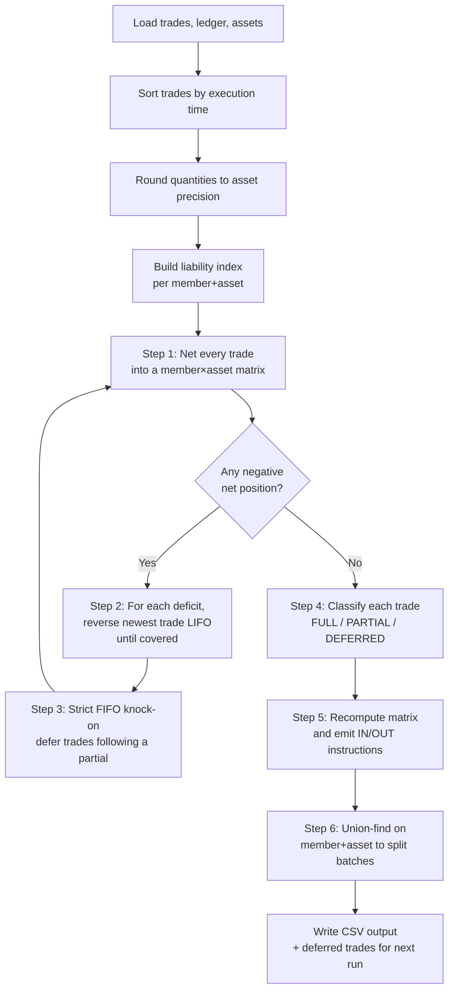
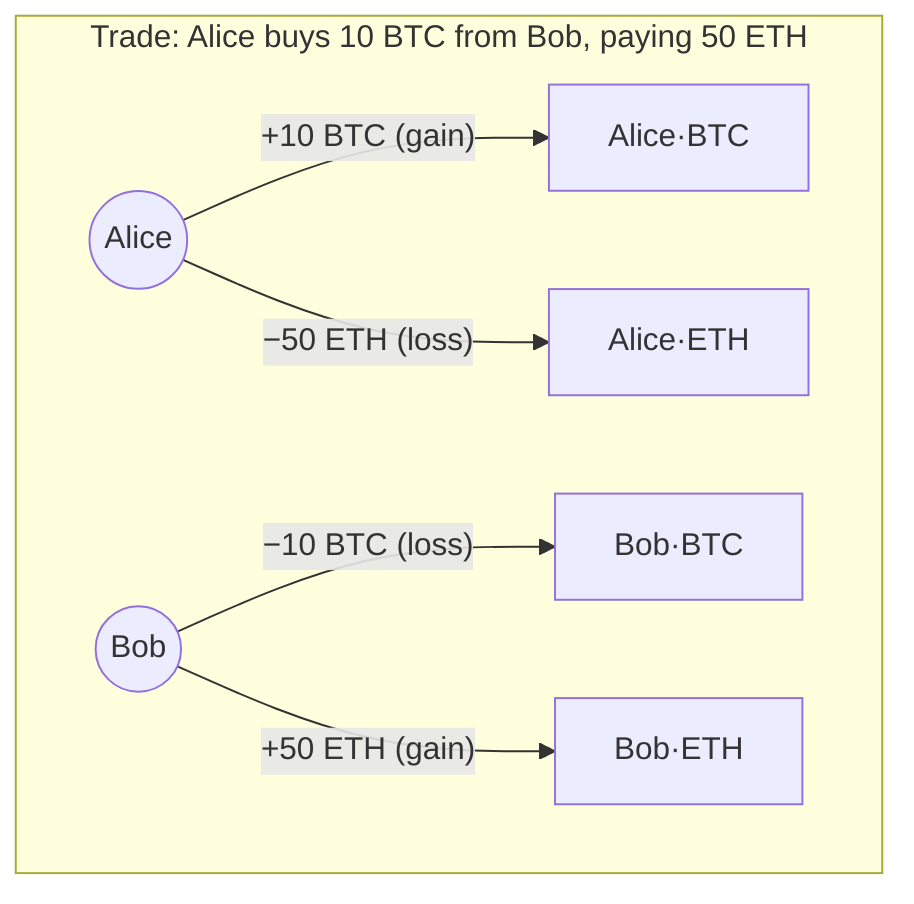
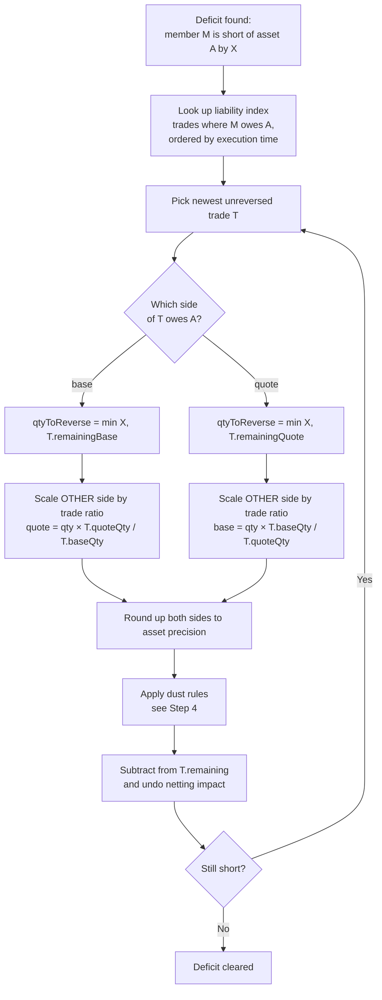
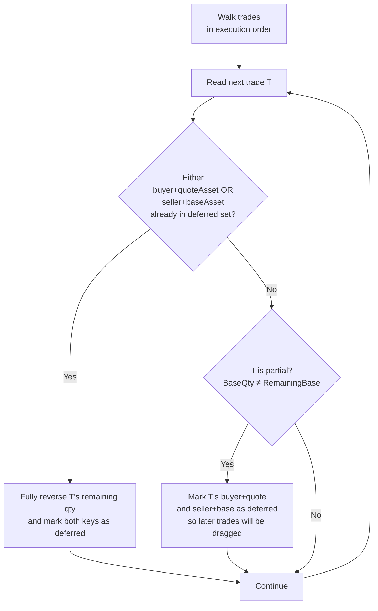
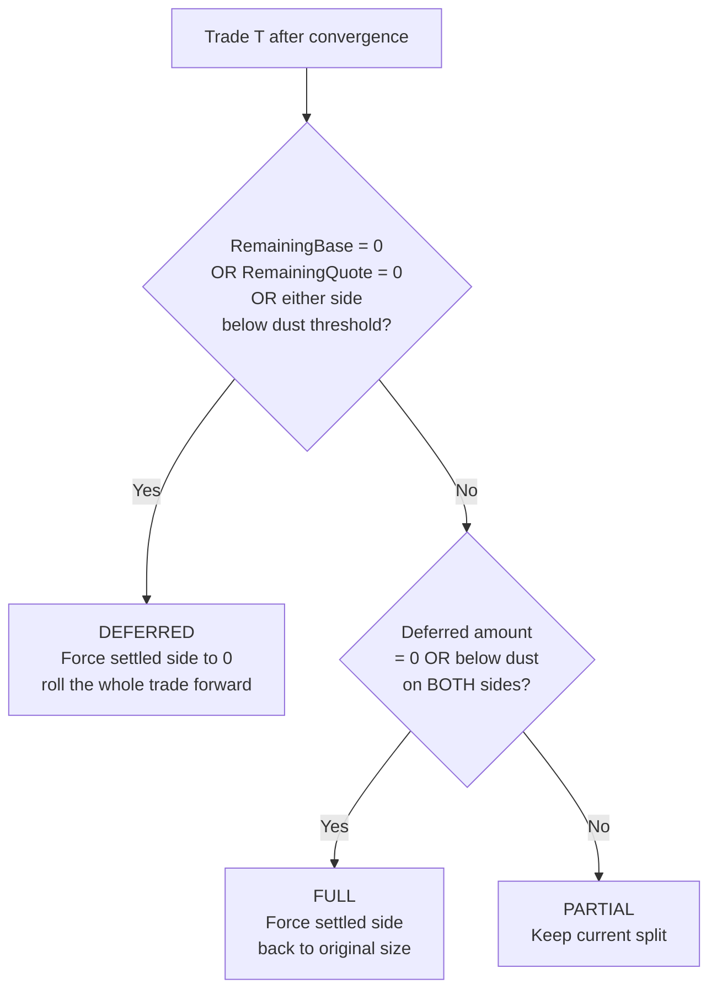
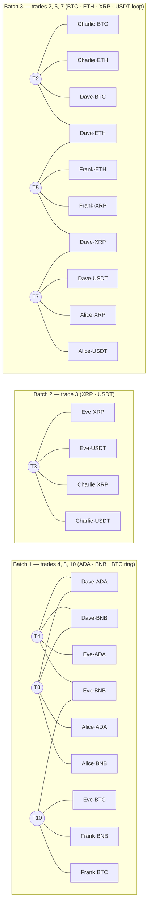

# How the Settlement Engine Works — A Business Walk-Through

This page explains, in plain English, what the multilateral settlement engine
does. We use the `small-sample` dataset to illustrate each step end-to-end.

---

## Table of Contents

1. [The problem we're solving](#1-the-problem-were-solving)
2. [The pipeline at a glance](#2-the-pipeline-at-a-glance)
3. [The `small-sample` dataset](#3-the-small-sample-dataset)
4. [Step 1 — Net everything](#4-step-1--net-everything)
5. [Step 2 — Resolve shortfalls by reversing the newest trade first](#5-step-2--resolve-shortfalls-by-reversing-the-newest-trade-first)
6. [Step 3 — Strict FIFO knock-on](#6-step-3--strict-fifo-knock-on)
7. [Step 4 — Classify each trade](#7-step-4--classify-each-trade)
8. [Step 5 — Generate settlement instructions](#8-step-5--generate-settlement-instructions)
9. [Step 6 — Split into independent batches](#9-step-6--split-into-independent-batches)
10. [Numeric precision and dust](#10-numeric-precision-and-dust)
11. [Why this matters](#11-why-this-matters)
12. [Glossary](#12-glossary)

---

## 1. The Problem We're Solving

At the end of a trading window we have:

- A list of **trades** that members agreed to with each other.
- A list of **member ledger balances** — how much of each asset each member
  actually holds *right now*.
- A list of **assets** with their decimal precision (e.g. BTC has 8 d.p.,
  USDT has 6 d.p.) and a "dust" threshold below which a residual is
  considered uneconomical to settle.

Some members will have agreed to deliver more of an asset than they
actually own. We cannot magically conjure assets, so some trades must
**wait (defer)** or **partially settle**.

The engine's job, every settlement window, is to:

1. Decide which trades settle in **FULL**, which settle **PARTIAL**ly, and
   which are **DEFERRED** to the next window.
2. Produce the minimum set of debits and credits — the **settlement
   instructions** — needed to move balances from "before" to "after".
3. Group everything into **independent batches** that can be settled
   atomically and in parallel, so a problem with one group doesn't block
   the others.
4. Honour two market rules at every step:
   - **LIFO unwinding** — if a member is short, unwind their *newest*
     trade first.
   - **Strict FIFO settlement** — if an earlier trade for a given
     member-asset position is not honoured in full, every later trade for
     that same position must also be deferred.

---

## 2. The Pipeline at a Glance



The loop between netting (E) and the resolution passes (G, H) is the heart of
the engine. On `small-sample` it converges in **5 iterations**.

---

## 3. The `small-sample` Dataset

### Members and opening balances (`ledger.csv`)

| Member  | Tier | BTC | ETH | XRP | ADA | BNB | USDT |
|---------|------|----:|----:|----:|----:|----:|-----:|
| Alice   | T1   |   8 |  50 |  40 |  20 | 200 |  100 |
| Bob     | T1   |   0 |  55 |   – |  50 |   – |    0 |
| Charlie | T1   |   5 |  25 |  20 |   – |   – |  200 |
| Dave    | T2   |   2 |   – |  12 |  10 |  50 |  200 |
| Eve     | T2   |  15 |   5 |  20 |   8 | 200 |  100 |
| Frank   | T2   |  15 |   1 |  50 |   0 | 150 |    0 |

A dash (–) means the member holds none of that asset.

### Trades (`trades.csv`)

| #  | Time (HH:MM:SS.mmm) | Buyer   | Seller  | Pair      | Buys   | Pays     |
|----|---------------------|---------|---------|-----------|--------|----------|
| 1  | 08:00:00.060        | Alice   | Bob     | BTC-ETH   | 10 BTC | 50 ETH   |
| 2  | 08:00:00.258        | Charlie | Dave    | BTC-ETH   | 5 BTC  | 25 ETH   |
| 3  | 08:00:00.901        | Eve     | Charlie | XRP-USDT  | 20 XRP | 200 USDT |
| 4  | 08:00:00.911        | Dave    | Eve     | ADA-BNB   | 10 ADA | 50 BNB   |
| 5  | 08:00:00.931        | Frank   | Dave    | ETH-XRP   | 25 ETH | 50 XRP   |
| 6  | 08:00:01.065        | Bob     | Eve     | ETH-USDT  | 10 ETH | 200 USDT |
| 7  | 08:00:01.409        | Dave    | Alice   | XRP-USDT  | 10 XRP | 100 USDT |
| 8  | 08:00:01.496        | Alice   | Dave    | ADA-BNB   | 20 ADA | 100 BNB  |
| 9  | 08:00:01.496        | Eve     | Bob     | ADA-USDT  | 2 ADA  | 100 USDT |
| 10 | 08:00:01.726        | Eve     | Frank   | BTC-BNB   | 15 BTC | 150 BNB  |

Trades are listed in the order they executed — order matters for both LIFO
unwinding and FIFO knock-on.

### Asset rules (`assets.csv`)

| Asset | Precision | Dust threshold |
|-------|----------:|---------------:|
| BTC   |         8 |     0.00000294 |
| ETH   |        18 |       1e-16    |
| XRP   |         6 |       0.0001   |
| ADA   |         6 |       1        |
| BNB   |        18 |       1e-16    |
| USDT  |         6 |       0.01     |

Precision controls how many decimal digits a quantity can carry; dust is
the smallest amount that's worth moving on the ledger.

---

## 4. Step 1 — Net Everything

We pretend, for a moment, that every trade settles in full. For each trade
we apply four flows to the member × asset matrix:



Buyer's base balance goes **up**, buyer's quote balance goes **down**.
Seller's base balance goes **down**, seller's quote balance goes **up**.
The four amounts always balance — settlement creates no value, it just
moves it.

### Net positions after all 10 trades

Summing all flows on top of the opening ledger:

| Member  | BTC | ETH | XRP | ADA | BNB | USDT |
|---------|----:|----:|----:|----:|----:|-----:|
| Alice   |  18 |   0 |  30 |  40 | 100 |  200 |
| Bob     | **−10** | 115 |   – |  48 |   – | **−100** |
| Charlie |  10 |   0 |   0 |   – |   – |  400 |
| Dave    | **−3** |  0 |  72 |   0 | 100 |  100 |
| Eve     |  30 | **−5** | 40 |  0 | 100 |    0 |
| Frank   |   0 |  26 |   0 |   0 | 300 |    0 |

Bolded cells are **deficits** — the member owes more than they have. Four
deficits to clear:

| # | Member | Asset | Net   | Shortfall | Caused by trades         |
|---|--------|-------|------:|----------:|--------------------------|
| 1 | Bob    | BTC   |   −10 | 10 BTC    | T1 (sells 10 BTC)        |
| 2 | Bob    | USDT  |  −100 | 100 USDT  | T6 (−200), T9 (+100), opening 0 |
| 3 | Dave   | BTC   |    −3 | 3 BTC     | T2 (sells 5 BTC, only owns 2) |
| 4 | Eve    | ETH   |    −5 | 5 ETH     | T6 (sells 10 ETH, only owns 5) |

> **Why net first?** A member may be short of an asset on one trade but
> *receive* that same asset on another trade in the same window. Netting
> captures that. We only act on what is *truly* uncovered after all
> incoming flows are considered. Without netting we'd reverse trades
> unnecessarily.

---

## 5. Step 2 — Resolve Shortfalls by Reversing the Newest Trade First

For every deficit, the engine **partially or fully reverses** the
member's most recent trade that put them on the deficit side of that
asset, walking backward until the deficit is cleared.



> **Why newest first (LIFO)?** Markets typically honour earlier
> commitments ahead of later ones. Unwinding the newest trade preserves
> the fairness of the trades that happened earlier.

### Reversal preserves the price ratio

If we reverse `q` units of the base side, the corresponding quote
reversal is:

```
quoteReversed = q × (trade.quoteQty / trade.baseQty)
```

That keeps the partially-settled portion of the trade at exactly the
original agreed price. The remaining settled portion is a smaller version
of the original trade, not a re-priced one.

### Worked example — Dave's 3 BTC shortfall

Dave is short 3 BTC. His only BTC liability is T2:

| | Base    | Quote  |
|--|---------|--------|
| Original T2  | 5 BTC | 25 ETH |
| Reverse | 3 BTC | 3 × (25 / 5) = **15 ETH** |
| Remains settled | 2 BTC | 10 ETH |

After this reversal:

- Dave delivers only **2 BTC** to Charlie (Dave's BTC balance is now 0,
  not −3 ✓).
- Charlie pays only **10 ETH** to Dave (Charlie's ETH balance is now 15,
  not 0).
- The deferred 3 BTC ↔ 15 ETH portion of T2 rolls forward to the next
  window.

T2's status is **PARTIAL**.

### What happens in `small-sample`

The engine iterates through deficits and reversals five times before the
matrix is fully non-negative. The final picture is:

- **T1 (Alice ↔ Bob)** — Bob's 10 BTC deficit equals T1's full base side.
  Fully reversed. **DEFERRED.**
- **T6 (Bob ↔ Eve)** — Eve is short 5 ETH on T6's base side. A partial
  reversal would leave a sub-dust remainder by ratio; combined with FIFO
  follow-on from earlier reversals, T6 collapses to **DEFERRED**.
- **T9 (Eve ↔ Bob)** — Bob is short USDT on T9. T9 is the newest of Bob's
  two USDT liabilities (T6, T9). Walking newest-first, T9 is reversed
  first, but Bob's earlier T6 also ends up deferred, so by FIFO T9 must
  also be deferred. **DEFERRED.**
- **T2 (Charlie ↔ Dave)** — Dave's 3 BTC deficit → T2 partially reversed
  by 3 BTC / 15 ETH. **PARTIAL.**
- **T3, T4, T5, T8** — each absorbs cascade pressure from the
  reversals above (e.g. when T1 is undone, Alice's BTC goes back down,
  which trickles through any downstream BTC obligations she had).
  All end as **PARTIAL** with the splits shown in §7.
- **T7, T10** — fully covered after the cascade. **FULL.**

---

## 6. Step 3 — Strict FIFO Knock-on

After every resolution pass, the engine walks the trades in execution
order. If a member's earlier trade for a given (member, asset) position is
not fully settled, every later trade for that same position is **fully
reversed**.



**Why the rule?** It prevents "queue-jumping": a later trade can't be
allowed to settle ahead of an earlier one for the same liability position.
Without this rule, member-asset position #N would feel happy ("my balance
is fine"), but the audit trail would show earlier counterparties getting
short-changed.

**In `small-sample`:**

- T6 ends partial → Bob's `(buyer, USDT)` is marked deferred → T9, which
  comes later and has Bob on the USDT-pay side, gets dragged into full
  deferral.
- T3 ends partial → marks Eve's `(buyer, USDT)`, but no later trade has
  Eve as a USDT-paying buyer, so nothing is dragged.
- Earlier trades (T1, T2) are never dragged by later ones, by
  construction.

The engine then loops back to Step 2 to clean up any new imbalances
introduced by the knock-on reversals. On `small-sample`, convergence
takes 5 iterations.

---

## 7. Step 4 — Classify Each Trade

After convergence, every trade gets one of three labels. The decision is:



`small-sample` result (`output/small-sample/trade-settlements.csv`):

| # | Buyer / Seller   | Pair     | Status   | Settled           | Deferred          |
|---|------------------|----------|----------|-------------------|-------------------|
| 1 | Alice / Bob      | BTC-ETH  | DEFERRED | –                 | 10 BTC ↔ 50 ETH   |
| 2 | Charlie / Dave   | BTC-ETH  | PARTIAL  | 2 BTC ↔ 10 ETH    | 3 BTC ↔ 15 ETH    |
| 3 | Eve / Charlie    | XRP-USDT | PARTIAL  | 10 XRP ↔ 100 USDT | 10 XRP ↔ 100 USDT |
| 4 | Dave / Eve       | ADA-BNB  | PARTIAL  | 8 ADA ↔ 40 BNB    | 2 ADA ↔ 10 BNB    |
| 5 | Frank / Dave     | ETH-XRP  | PARTIAL  | 10 ETH ↔ 20 XRP   | 15 ETH ↔ 30 XRP   |
| 6 | Bob / Eve        | ETH-USDT | DEFERRED | –                 | 10 ETH ↔ 200 USDT |
| 7 | Dave / Alice     | XRP-USDT | FULL     | 10 XRP ↔ 100 USDT | –                 |
| 8 | Alice / Dave     | ADA-BNB  | PARTIAL  | 18 ADA ↔ 90 BNB   | 2 ADA ↔ 10 BNB    |
| 9 | Eve / Bob        | ADA-USDT | DEFERRED | –                 | 2 ADA ↔ 100 USDT  |
| 10| Eve / Frank      | BTC-BNB  | FULL     | 15 BTC ↔ 150 BNB  | –                 |

Totals: **2 FULL, 5 PARTIAL, 3 DEFERRED**.

The deferred portions (all of T1, T6, T9 plus the deferred halves of
T2-T5 and T8) roll forward to the next settlement window's input.

---

## 8. Step 5 — Generate Settlement Instructions

The engine recomputes the netting matrix using the *final* settled
quantities (not the original trade quantities). For every (member, asset)
cell where the closing balance differs from the opening balance, it emits
one instruction:

- `IN`  — the member's holding increases by `NetAmount`.
- `OUT` — the member's holding decreases by `NetAmount`.

Cells that net to zero produce no instruction (no need to move
anything).

**Worked example.** Alice's ADA: opening 20, T8 settled 18, so her closing
balance is **20 + 18 = 38** ADA, an `IN` of 18.

The output is `output/small-sample/settlement-instructions.csv`, **22
rows** in total, partitioned into the batches shown next.

---

## 9. Step 6 — Split Into Independent Batches

Two batches are **independent** if no member-asset pair appears in both.
That means they can be settled in parallel, and a failure in one cannot
affect the others.

### How the split is computed

The engine uses **union-find** (a.k.a. disjoint-set) over `(member,
asset)` keys. For each settled trade it merges the four keys it touches:

```
union(buyer·base,  buyer·quote)
union(buyer·base,  seller·base)
union(buyer·base,  seller·quote)
```

After processing all trades, each connected component becomes a batch.
Standalone instructions (rare) get their own roots.

### The three batches of `small-sample`



Each subgraph above is a **connected component** in the union-find sense
— every node inside is reachable from every other via the trade edges in
that batch. Crucially, **no node label is repeated across batches**:
`Dave·ADA` lives in Batch 1, `Dave·BTC` lives in Batch 3, but they're
different keys, so the batches don't interfere.

### Batch 1 instructions

| Member | Asset | Opening |    Δ | Direction | Closing |
|--------|-------|--------:|-----:|-----------|--------:|
| Alice  | ADA   |      20 |  +18 | IN        |      38 |
| Alice  | BNB   |     200 |  −90 | OUT       |     110 |
| Eve    | ADA   |       8 |   −8 | OUT       |       0 |
| Eve    | BNB   |     200 | −110 | OUT       |      90 |
| Eve    | BTC   |      15 |  +15 | IN        |      30 |
| Dave   | ADA   |      10 |  −10 | OUT       |       0 |
| Dave   | BNB   |      50 |  +50 | IN        |     100 |
| Frank  | BNB   |     150 | +150 | IN        |     300 |
| Frank  | BTC   |      15 |  −15 | OUT       |       0 |

ADA flows from Dave & Eve to Alice (T4 partial, T8 partial). BNB flows
from Alice & Eve to Dave & Frank (covering T4, T8, T10). BTC flows from
Frank to Eve (T10 in full).

### Batch 2 instructions

| Member  | Asset | Opening |    Δ | Direction | Closing |
|---------|-------|--------:|-----:|-----------|--------:|
| Eve     | USDT  |     100 | −100 | OUT       |       0 |
| Eve     | XRP   |      20 |  +10 | IN        |      30 |
| Charlie | USDT  |     200 | +100 | IN        |     300 |
| Charlie | XRP   |      20 |  −10 | OUT       |      10 |

Half of T3 settles — 10 XRP for 100 USDT — between just two members.

### Batch 3 instructions

| Member  | Asset | Opening |    Δ | Direction | Closing |
|---------|-------|--------:|-----:|-----------|--------:|
| Alice   | USDT  |     100 | +100 | IN        |     200 |
| Alice   | XRP   |      40 |  −10 | OUT       |      30 |
| Dave    | BTC   |       2 |   −2 | OUT       |       0 |
| Dave    | USDT  |     200 | −100 | OUT       |     100 |
| Dave    | XRP   |      12 |  +30 | IN        |      42 |
| Frank   | ETH   |       1 |  +10 | IN        |      11 |
| Frank   | XRP   |      50 |  −20 | OUT       |      30 |
| Charlie | BTC   |       5 |   +2 | IN        |       7 |
| Charlie | ETH   |      25 |  −10 | OUT       |      15 |

A four-asset cycle: Dave delivers BTC + USDT, receives XRP; Charlie
delivers ETH, receives BTC + USDT; Frank delivers XRP, receives ETH;
Alice delivers XRP, receives USDT.

### Deferred trades (no batch)

T1, T6, T9 settle nothing this window. They're written into the
deferred-trades section of the output and re-fed into the next run.

---

## 10. Numeric Precision and Dust

Every quantity is held internally as a **scaled big-integer** with 20
decimal digits of precision (i.e. the engine multiplies every input by
10²⁰ on the way in and divides on the way out). This avoids floating-point
rounding errors and lets the engine handle any asset's decimal places
exactly.

Two per-asset values control rounding behaviour:

- **Precision** — how many decimal digits a quantity may carry. Quantities
  going into the engine are rounded *down* to this precision; quantities
  coming out of a reversal are rounded *up*, so a reversal never
  under-undoes.
- **Dust threshold** — the smallest amount worth moving. Anything between
  zero (exclusive) and the threshold is considered dust.

### How dust is applied in a reversal


The rule is: **every leg of every reversal is either zero, or above dust
on both sides.** Sub-dust residuals never appear in the output.

In `small-sample` all asset units are whole numbers (BTC, ETH counted in
whole units), so dust never bites. On production data it prevents the
engine from emitting 0.000001-BTC dribbles that cost more in network fees
than the value they move.

---

## 11. Why This Matters

- **Liquidity efficiency.** Members never deliver assets they don't have,
  but they also never under-settle when they do.
- **Deterministic fairness.** LIFO unwinding and strict FIFO settlement
  give the same answer for the same inputs every time — no ordering
  arbitrariness.
- **Operational isolation.** Independent batches mean a hold on one
  group's funds doesn't freeze the others. The 22 instructions of
  `small-sample` ship as three independent transfers, not one giant one.
- **Audit-grade arithmetic.** Scaled big-integer math + explicit
  precision/dust rules mean the engine's output is reproducible bit-for-
  bit. The validator (`go run ./cmd/validator small-sample`) re-checks
  that net flows match instructions and that FIFO holds — both pass on
  every dataset.

---

## 12. Glossary

| Term                  | Meaning                                                                       |
|-----------------------|-------------------------------------------------------------------------------|
| Base / Quote          | The two assets in a trading pair (in BTC-ETH, BTC is base, ETH is quote).     |
| Netting               | Adding up all gains and losses per (member, asset) before settling.           |
| Net position          | A member's opening balance plus all their netted trade flows in this window.  |
| Deficit / Shortfall   | A negative net position — a member owes more than they have.                  |
| Reverse / Unwind      | Cancelling part or all of a trade.                                            |
| LIFO                  | Last-in-first-out — unwind the newest trade first.                            |
| FIFO                  | First-in-first-out — earlier trades settle before later ones.                 |
| Strict FIFO knock-on  | If trade T₁ is partial/deferred, every later trade on the same position is deferred. |
| Liability             | The asset side a member owes on a given trade (base if seller, quote if buyer). |
| Precision             | Maximum number of decimal digits an asset's quantity may carry.               |
| Dust                  | An amount that is positive but below the asset's dust threshold.              |
| Batch                 | A maximal group of (member, asset) keys connected through settled trades.     |
| Union-find            | The algorithm used to compute connected components for batching.              |
| FULL / PARTIAL / DEFERRED | The three possible outcomes for any trade after convergence.              |
